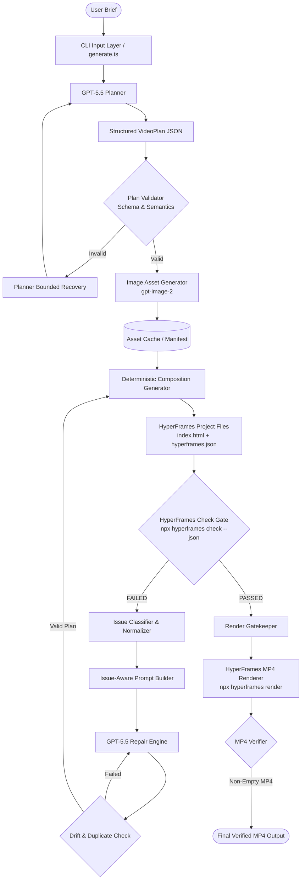

# HyperFrames Motion Graphics Generator

An autonomous AI-driven motion graphics video generation system that converts plain-language user briefs into verified, broadcast-quality [HyperFrames](https://github.com/heygen-com/hyperframes) video compositions and rendered MP4 files.

## What It Does

The HyperFrames Motion Graphics Generator automates the full video creation lifecycle through an autonomous closed-loop pipeline:
Plain-language brief → GPT-5.5 structured plan → gpt-image-2 assets → deterministic HyperFrames composition → HyperFrames check → automatic repair → MP4 rendering → final verification.

## Key Engineering Idea

This project is **not** simply:
`LLM → HTML → video`

Directly generating raw code or HTML from LLMs produces high failure rates due to unconstrained layout overflow, color contrast violations, broken animations, and non-deterministic DOM structures.

Instead, this system operates on the core principle:
**LLM plans → deterministic generator → independent validation → structured repair → render only after validation**

1. **Structured Planning**: The LLM plans scene breakdown, layout geometry, typography, color palettes, and motion timings into a strictly typed JSON schema (`VideoPlan`).
2. **Deterministic Composition**: A rule-based compiler deterministically renders valid HyperFrames HTML5/CSS/GSAP projects from the validated plan without non-deterministic code generation.
3. **Independent Validation Gate**: The official `npx hyperframes check` CLI acts as an authoritative, independent quality gatekeeper.
4. **Issue-Aware Repair**: Validation failures are classified into normalized error domains (`LAYOUT`, `CONTRAST`, `MOTION`, `RUNTIME`), prompting targeted plan repairs before re-compiling.
5. **Hard Render Gate**: Videos are rendered (`npx hyperframes render`) ONLY after passing validation with 0 errors.

---

## Features

- **End-to-End Automation**: Converts text briefs directly into MP4 videos without manual editing.
- **Multi-Aspect Ratio Support**: Native support for 16:9 Widescreen (1920x1080) and 9:16 Vertical Social (1080x1920).
- **Dual-Layer Plan Validation**: Validates Zod runtime schema constraints and semantic invariants (durations, non-overlapping scene timings, heading lengths).
- **Visual Asset Integration**: `gpt-image-2` image generation engine with SHA-256 content-addressed caching and SVG placeholder fallbacks.
- **Official Quality Verification**: Integrates `npx hyperframes check` to inspect DOM overflow, WCAG AA contrast compliance, and JS execution.
- **Bounded Self-Repair Loop**: Automatically repairs flawed plans up to `MAX_REPAIR_ATTEMPTS = 3` with drift prevention.
- **Automated MP4 Rendering**: Executes `npx hyperframes render` to export broadcast-ready MP4 files.
- **Secret & Token Sanitization**: Redacts API keys and Bearer tokens from logs and intermediate JSON output.

---

## Architecture



---

## Requirements

- **Node.js**: `>= 18.0.0` (v20+ recommended)
- **npm**: `>= 9.0.0`
- **System Dependencies**:
  - **FFmpeg**: Required for MP4 video rendering (`npx hyperframes render`). Ensure `ffmpeg` is installed on system `PATH`.
  - **Chromium / Puppeteer Dependencies**: Required by `hyperframes check` for headless browser validation.

---

## Quick Start (Clean-Clone Instructions)

Follow these exact commands to install and run the generator on a clean machine:

### 1. Clone Repository
```bash
git clone https://github.com/Ganesh-123-maker/hyperframes-motion-generator.git
cd hyperframes-motion-generator
```

### 2. Install Dependencies
```bash
npm install
```

### 3. Configure Environment Variables
Copy `.env.example` to `.env`:
```bash
cp .env.example .env
```

Open `.env` and configure your API credentials:
```env
OPENAI_API_KEY=your_openai_api_key_here
OPENAI_BASE_URL=https://llm.ganeshnayak.in/v1
PLANNING_MODEL=gpt-5.5
IMAGE_MODEL=gpt-image-2
MAX_REPAIR_ATTEMPTS=3
```
> [!IMPORTANT]
> Never commit your actual API key to version control. The `.env` file is excluded in `.gitignore`.

### 4. Run Motion Generator
Generate a video from a plain-language prompt:
```bash
npm run generate -- --brief "Create a 12 second widescreen advertisement for a developer analytics platform"
```

---

## Usage & CLI Options

```bash
# Generate widescreen video from inline brief
npm run generate -- --brief "Create a 12 second widescreen ad for developer analytics"

# Generate vertical video for social media
npm run generate -- --brief "Create an 8 second vertical social video announcing a modern coffee shop opening"

# Generate vertical launch announcement
npm run generate -- --brief "Create a 10 second vertical launch announcement for a productivity app with three animated benefits and a final call to action."

# Generate video from pre-saved brief file
npm run generate -- --file examples/briefs/brief-1.txt

# Run with dry-run mode (uses local reference plan, no remote API calls needed)
npm run generate -- --example brief-1 --dry-run
```

### CLI Command Flags
| Flag | Description | Default |
| :--- | :--- | :--- |
| `--brief <text>` | Plain-language prompt describing desired video | None |
| `--file <path>` | Path to a text file containing the brief | None |
| `--example <name>` | Run pre-packaged example (`brief-1`, `brief-2`, `brief-3`) | None |
| `--out <dir>` | Output directory for artifacts and renders | `./outputs` |
| `--plan-model <m>` | LLM model name for planning & repair | `gpt-5.5` |
| `--image-model <m>`| LLM model name for image generation | `gpt-image-2` |
| `--max-repair <n>` | Maximum allowed repair attempts | `3` |
| `--skip-render` | Run planning, composition, & check without MP4 rendering | `false` |
| `--strict` | Treat HyperFrames check warnings as fatal errors | `false` |
| `--dry-run` | Use offline reference plan & mock asset generator | `false` |

---

## Pipeline Breakdown

```
Brief ↓ Plan ↓ Assets ↓ Composition ↓ HyperFrames Check ↓ Repair if needed ↓ Render ↓ Verify MP4
```

1. **Brief Ingestion**: Parses natural language requirements for aspect ratio, tone, duration, and target scenes.
2. **GPT-5.5 Planning**: Produces a strictly-typed `VideoPlan` specifying scenes, timing, layout bounds, typography, and color tokens.
3. **Asset Generation**: Synthesizes custom visuals via `gpt-image-2` (decoding base64 PNGs) with content-hash asset caching.
4. **Composition Generation**: Compiles standard HyperFrames HTML5, CSS layout grids, and GSAP timing sequences.
5. **HyperFrames Quality Check**: Invokes `npx hyperframes check . --json` to perform automated verification.
6. **Bounded Repair**: If check fails, error reports are fed into GPT-5.5 to produce a targeted plan fix up to 3 attempts.
7. **MP4 Rendering**: Invokes `npx hyperframes render . --output mp4` to bake the composition into an MP4 file.
8. **Output Verification**: Asserts that the output MP4 exists, is non-empty (>0 bytes), and logs runtime metadata.

---

## Validation & Self-Repair

### Quality Gatekeeper
Every composition is validated using:
```bash
npx hyperframes check . --json
```
If `npx hyperframes check` returns errors (`"ok": false`), the composition is **strictly blocked** from rendering.

### Bounded Repair Loop
When validation errors occur:
1. `IssueClassifier` categorizes errors into `LAYOUT`, `CONTRAST`, `MOTION`, `RUNTIME`, or `LINT`.
2. `RepairPromptBuilder` constructs an issue-focused repair prompt including exact failure context.
3. `GPT-5.5` receives the current plan, failure JSON, and exact repair guidelines to produce a repaired plan.
4. `DriftDetector` verifies that the repair preserves core brief constraints (e.g. aspect ratio, target duration) while resolving issues.
5. Up to 3 repair attempts are made. If all attempts fail, the process terminates loudly without rendering bad output.

---

## Determinism & Reproducibility Guarantees

- **100% Deterministic Generator**: The composition engine (`src/composition/`) translates JSON plans into HTML/CSS/GSAP code using pure, deterministic TypeScript templates. Given the same `VideoPlan`, the output HyperFrames project is identical.
- **Content-Addressed Asset Caching**: Generated images are stored using SHA-256 hashes of their prompt and resolution. Duplicate requests hit local disk cache instantly.
- **Seeded LLM Completions**: Remote model calls use fixed random seeds (`seed: 42`, `temperature: 0.1`).
- **Remote Model Behavior**: Be aware that remote LLM gateway providers can occasionally exhibit minor non-determinism across API upgrades. The deterministic generator and quality check gate guarantee visual stability regardless of model variation.

---

## Output Structure

Outputs are stored under `outputs/<run-id>/`:

```
outputs/<run-id>/
├── brief.txt                 # Input text brief
├── plan.json                 # Validated final VideoPlan JSON
├── repair-history.json       # Machine-readable repair attempt log
├── composition/              # Verified HyperFrames project
│   ├── index.html            # Responsive DOM composition structure
│   ├── hyperframes.json      # HyperFrames project configuration
│   └── assets/               # Image assets (PNG / SVG)
├── attempts/                 # Preserved history of all repair attempts
│   ├── attempt-1/            # Failed attempt 1 plan, check log, & comp
│   └── attempt-2/            # Repaired attempt 2 passing artifacts
└── render/                   # Final video output directory
    ├── render.mp4            # Verified broadcast-ready MP4 video file
    ├── render.log            # HyperFrames render execution log
    └── metadata.json         # Render resolution, duration, & filesize stats
```

---

## Testing & Quality Assurance

Run the test suite:
```bash
npm test
```

Run TypeScript typechecking & linting:
```bash
npm run typecheck
npm run lint
```

Build production bundle:
```bash
npm run build
```

Clean output artifacts:
```bash
npm run clean
```

### Test Suite Highlights
- **Schema & Semantic Tests**: Verifies plan validation rules.
- **Deterministic Mock Repair Scenario**: Tests end-to-end failure detection, plan repair, and passing second attempt.
- **Forced-Failure Scenario**: Tests process exit when repair attempts are exhausted (`MAX_REPAIR_ATTEMPTS = 3`).
- **Secret Sanitization Unit Tests**: Validates redaction of `sk-`, `AIza`, and `Bearer` tokens.

---

## Documentation & System Design

- **[Documentation Index](docs/README.md)**: Central directory for all docs.
- **[Final System Design Document](docs/final-system-design.md)**: Full architecture specifications, requirement traceability matrix, and technical decisions.
- **[Evaluation Results](docs/evaluation-results.md)**: Empirical test results across widescreen, vertical, and text-heavy video briefs.
- **[Submission Checklist](docs/submission-checklist.md)**: Final verification checklist for evaluation.

---

## System Limitations

1. **System FFmpeg Requirement**: MP4 rendering requires system-level `ffmpeg` binaries. Without `ffmpeg`, rendering falls back or halts after composition validation.
2. **Headless Browser Execution Time**: Running `npx hyperframes check` launches Puppeteer, adding 30-45 seconds of validation overhead per run.
3. **External Gateway Latency**: Remote LLM generation speed depends on network latency to the gateway provider.
