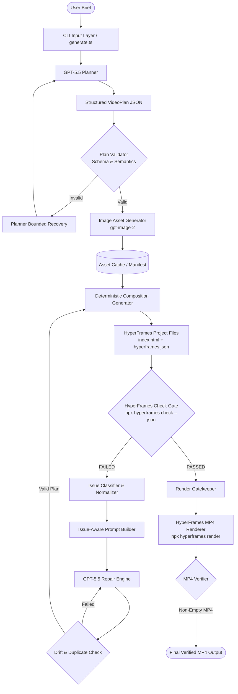

# HyperFrames Motion Generator — System Design & Architecture Document

This document provides a comprehensive technical overview of the **HyperFrames Motion Generator**, an autonomous AI-driven system that converts plain-language video briefs into verified, rendered motion-graphics videos.

---

# SECTION 1 — Problem Statement & Architectural Core

## The Problem
Converting a high-level natural language prompt into a broadcast-quality video is traditionally prone to visual, spatial, and timing defects:
- Text overflowing container boundaries across different aspect ratios.
- Color contrast violations violating WCAG AA accessibility standards.
- Uncaught JavaScript errors during timeline execution.
- Non-deterministic code generation when models attempt to output raw HTML/JS directly.

## The Architectural Core
To eliminate these failures, the system implements an **autonomous closed loop**:

```
brief → GPT-5.5 planning → schema validation → asset generation → deterministic composition → HyperFrames check gate → (repair loop if failed) → rendering → MP4 verification
```

There is **no manual intervention** between pipeline stages. The official `npx hyperframes check` validation tool acts as the authoritative quality gatekeeper. Only compositions passing the gate with 0 fatal errors are allowed to proceed to rendering.

---

# SECTION 2 — Requirements Traceability Matrix

| Requirement | Implementation Component | Technical Mechanism | Status |
| :--- | :--- | :--- | :--- |
| **Plain-language brief input** | CLI (`src/cli/generate.ts`) | `--brief`, `--file`, `--example` arguments | Done |
| **GPT-5.5 planning** | Planner (`src/planner/planner.ts`) | LLM completion with structured JSON format | Done |
| **Real planning artifact** | Artifact Saver (`savePlanningArtifacts`) | Written to `outputs/<run-id>/plan.json` | Done |
| **HyperFrames composition** | Generator (`src/composition/generator.ts`) | Deterministic HTML5/GSAP/CSS compilation | Done |
| **gpt-image-2 asset generation** | Image Engine (`src/image/generator.ts`) | Base64 PNG decoding & SHA-256 caching | Done |
| **HyperFrames quality check** | Checker (`src/checker/hyperframesChecker.ts`) | Executes `npx hyperframes check . --json` | Done |
| **Automatic self-repair** | Repair Engine (`src/repair/`) | Bounded repair loop (`MAX_REPAIR_ATTEMPTS = 3`) | Done |
| **MP4 video rendering** | Renderer (`src/render/renderer.ts`) | Executes `npx hyperframes render . --output mp4` | Done |
| **Output verification** | Verifier (`src/render/renderer.ts`) | File stat validation, size & log metadata | Done |
| **Widescreen video (16:9)** | Layout Geometry (`src/composition/layout.ts`) | 1920x1080 canvas & responsive grid layout | Done |
| **Vertical video (9:16)** | Layout Geometry (`src/composition/layout.ts`) | 1080x1920 canvas & mobile-first stacked layout | Done |
| **Text-heavy explainer (15s)** | Scene Renderer (`src/composition/renderers/`) | Progress indicators, benefit cards, typography | Done |
| **Determinism & reproducibility** | Cache & Seeding (`src/image/cache.ts`) | Hash-based asset reuse, fixed random seeds | Done |

---

# SECTION 3 — System Architecture



---

# SECTION 4 — Component Breakdown

### 1. Input Layer (`src/cli/generate.ts`)
Validates CLI parameters, parses input briefs from strings or files, loads environment variables safely, and configures run directories.

### 2. GPT-5.5 Planner (`src/planner/planner.ts`)
Converts the plain-language brief into a structured motion-graphics specification (`VideoPlan`). It defines title, duration, fps, aspect ratio, theme colors, scene sequence, and call-to-action details.

### 3. Plan Validator (`src/planner/validator.ts`)
Executes dual-phase validation:
- **Schema Validation**: Parses types, ranges, and string lengths via Zod (`VideoPlanSchema`).
- **Semantic Validation**: Verifies positive durations, non-overlapping scene timings, aspect ratio / dimension consistency, unique scene IDs, and non-empty headings.

### 4. Image Asset Generator (`src/image/generator.ts`)
Scans scene visual specs for `generated_image` requirements, dispatches prompts to `gpt-image-2`, decodes base64 PNG responses, writes files to `assets/`, tracks hashes in `manifest.json`, and falls back to deterministic SVG placeholders if offline.

### 5. Deterministic Composition Generator (`src/composition/generator.ts`)
Translates `VideoPlan` into a valid HyperFrames project without relying on LLM code generation. It generates:
- `index.html`: Responsive viewport HTML structure.
- `hyperframes.json`: HyperFrames project configuration.
- GSAP Timeline script: Choreographed scene entrances, exits, and ambient motions.
- Theme tokens: CSS gradient backgrounds, surface cards, and typography.

### 6. HyperFrames Checker (`src/checker/hyperframesChecker.ts`)
Executes `npx hyperframes check <dir> --json` via `execFile` with headless Chrome. Acts as the mandatory quality gate.

### 7. Issue Classifier & Normalizer (`src/checker/classifier.ts`)
Normalizes findings into typed `NormalizedIssue` objects under 6 categories: `LAYOUT`, `CONTRAST`, `MOTION`, `RUNTIME`, `LINT`, `UNKNOWN`.

### 8. Repair Engine (`src/repair/`)
Translates quality findings into category-specific guidance (`src/repair/prompt.ts`) and calls GPT-5.5 to repair the structured plan. `src/repair/drift.ts` prevents creative drift and detects duplicate/identical plans.

### 9. Renderer (`src/render/renderer.ts`)
Invokes `npx hyperframes render <dir> --output <mp4_path>` using system or static FFmpeg/FFprobe binaries.

### 10. MP4 Verifier (`src/render/renderer.ts`)
Confirms that the output MP4 exists, is greater than 0 bytes, writes `metadata.json`, and saves `render.log`.

---

# SECTION 5 — Data Flow Architecture

```
brief.txt (Raw Brief Text)
    ↓
PlanRequest { brief, model, seed }
    ↓
VideoPlan (Structured JSON Schema)
    ↓
AssetManifest { assets: [{ sceneId, path, hash }] }
    ↓
Composition Project Directory (index.html, hyperframes.json, assets/)
    ↓
HyperFramesCheckResult { ok, exitCode, issues: NormalizedIssue[] }
    ↓
RepairRequest { originalPlan, currentPlan, issues }
    ↓
Repaired VideoPlan (Validated Schema)
    ↓
Regenerated Composition
    ↓
render.mp4 + metadata.json + render.log
```

---

# SECTION 6 — Why Planning Precedes Code Generation

We explicitly require GPT-5.5 to produce a **structured JSON plan** before compiling HyperFrames code:

1. **Separation of Intent vs Implementation**: GPT-5.5 determines *WHAT* to convey (story, scenes, timing, text, colors). The application determines *HOW* to implement it in HTML/GSAP/CSS.
2. **Schema Safety**: Structured plans are bounded by Zod validation, preventing invalid HTML syntax or broken script tags.
3. **Inspectability**: Human engineers and verification scripts can inspect `plan.json` directly.
4. **Targeted Repair**: When validation fails, repairing specific JSON fields is far more precise than rewriting full HTML files.

---

# SECTION 7 — Key Design Decisions

| Decision Area | Chosen Approach | Justification |
| :--- | :--- | :--- |
| **Planning Representation** | Structured Zod JSON (`VideoPlan`) | Inspectable, schema-valid, reproducible |
| **Composition Generation** | Deterministic Compilation | Prevents code drift, ensures 100% syntactically valid HTML/GSAP |
| **Quality Verification** | Official `npx hyperframes check` | Authoritative, checks layout, contrast, and JS runtime |
| **Repair Strategy** | Structured Plan Repair | Bounded edits, prevents code corruption |
| **Asset Pipeline** | Base64 PNG + Content Hash Cache | Eliminates duplicate API calls, enables offline testing |
| **Loop Bounding** | `MAX_REPAIR_ATTEMPTS = 3` | Prevents infinite loops and runaway API costs |
| **Artifact Hierarchy** | Per-attempt folders (`attempts/attempt-N/`) | Full auditability and submission evidence |
| **Secret Management** | `process.env` + `sanitizeOutput()` | Ensures zero API key leaks in logs or artifacts |

---

# SECTION 8 — Rejected Alternatives

### 1. Direct LLM → HTML/JS Generation
- **Rejected because**: High nondeterminism, frequent syntax errors, fragile animation timelines, un-testable output, and difficulty constraining LLM output.

### 2. LLM Editing Arbitrary Generated HTML/JS Code
- **Rejected because**: Fixing a contrast error in CSS often caused the model to break JavaScript timelines or delete layout elements.

### 3. Proceeding Without a Hard Verification Gate
- **Rejected because**: Plausible-looking HTML can fail runtime execution or WCAG contrast compliance. Verification must be strictly enforced.

### 4. Unbounded Retry Loops (`while (true)`)
- **Rejected because**: Infinite loops waste tokens and hide systemic model/schema flaws.

---

# SECTION 9 — Failure Handling Matrix

| Failure Point | Detection Method | System Response |
| :--- | :--- | :--- |
| **LLM Syntax Error** | `JSON.parse` exception | Bounded planner retry with syntax feedback prompt |
| **Schema/Semantic Failure** | `validateFullPlan` returns `ok: false` | Re-prompts planner with detailed error field list |
| **Image Generation API Failure** | Catch block in asset generator | Falls back to SVG placeholder, logs notice |
| **HyperFrames Check Failure** | `result.ok === false` or `exitCode !== 0` | Extracts issues, runs repair loop up to `MAX_REPAIR_ATTEMPTS` |
| **Identical Repair Plan** | `isIdenticalPlan` check | Rejects repair as ineffective, mutates tokens or fails attempt |
| **Creative Plan Drift** | `detectPlanDrift` check | Rejects unauthorized aspect ratio or scene drops |
| **Max Repair Attempts Reached** | `attempt === MAX_REPAIR_ATTEMPTS` | Fails loudly (exit code 1), prints unresolved issues, blocks render |
| **FFmpeg/Render Error** | 0-byte MP4 file or non-zero exit code | Writes `render.log`, terminates with exit code 1 |

---

# SECTION 10 — Automatic Self-Verification & Repair Loop

```
Generate Composition
        ↓
npx hyperframes check . --json
        ↓
    Is Check OK?
    ├── YES ──> Proceed to Rendering (Phase 6)
    └── NO
        ↓
    Extract Normalized Issues (Layout, Contrast, etc.)
        ↓
    Attempt < MAX_REPAIR_ATTEMPTS?
    ├── NO ──> FAIL LOUDLY (Exit Code 1, Save Attempts)
    └── YES
        ↓
    Invoke GPT-5.5 Plan Repair
        ↓
    Validate Repaired Plan (Schema + Semantic + Drift)
        ↓
    Regenerate Composition & Re-check
```

### Key Loop Guarantees:
- `MAX_REPAIR_ATTEMPTS = 3` default limit.
- Per-attempt artifacts stored in `outputs/<run-id>/attempts/attempt-<N>/`.
- Machine-readable `repair-history.json` saved for every run.
- Render gate semantics: No failed composition is EVER rendered to MP4.

---

# SECTION 11 — Determinism & Reproducibility

### What is 100% Deterministic:
- Plan validation and semantic checking.
- HyperFrames composition generation (HTML structure, CSS grid layout, GSAP timeline scripting).
- Image asset caching (SHA-256 hash matching).
- Rule-based plan fallback when operating offline.

### What Involves Controlled Model Generation:
- Initial GPT-5.5 planning completion (controlled via `seed: 42`, `temperature: 0.1`).
- `gpt-image-2` visual generation (cached upon first retrieval).

---

# SECTION 12 — Aspect Ratio & Layout Strategy

The generator supports three aspect ratios:
1. **Widescreen (`16:9` / 1920x1080)**: Horizontal layout, side-by-side split cards, multi-column feature grids.
2. **Vertical (`9:16` / 1080x1920)**: Vertical stacked layout, mobile-optimized typography, top/bottom card arrangement.
3. **Square (`1:1` / 1080x1080)**: Balanced square grid and hero badge layouts.

Layout geometry is computed dynamically in `src/composition/layout.ts`.

---

# SECTION 13 — Artifact Storage Strategy

Outputs are organized hierarchically under `outputs/<run-id>/`:

```
outputs/<run-id>/
├── brief.txt                 # Exact input brief
├── plan.json                  # Validated final VideoPlan
├── repair-history.json        # Machine-readable attempt history
├── composition/               # Final passing HyperFrames composition project
│   ├── index.html
│   ├── hyperframes.json
│   └── assets/
├── attempts/                  # Preserved attempt history for auditing
│   ├── attempt-1/
│   │   ├── plan.json
│   │   ├── check.json
│   │   └── composition/
│   └── attempt-2/
│       ├── plan.json
│       ├── check.json
│       └── composition/
└── render/                    # Output video artifacts
    ├── render.mp4             # Final rendered MP4 video
    ├── render.log             # FFmpeg/HyperFrames render log
    └── metadata.json          # File size and render duration metadata
```

---

# SECTION 14 — Security & Secret Protection

- Environment variables (`OPENAI_API_KEY`, `OPENAI_BASE_URL`) loaded securely via `dotenv`.
- `.env` excluded from version control (`.gitignore`).
- All log outputs and stored JSON artifacts pass through `sanitizeOutput()` to redact API keys (`sk-`, `AIza`, `Bearer`).
- Security search audit confirms zero credentials in git history.

---

# SECTION 15 — Testing Strategy

The repository contains 72 unit tests across 5 test suites (`npm test`):
- `test/planner.test.ts`: Tests brief parsing, Zod validation, and semantic bounds.
- `test/composition.test.ts`: Tests deterministic HTML/GSAP compilation and layout math.
- `test/image.test.ts`: Tests base64 decoding, image manifest hashing, and fallback SVG generation.
- `test/checker.test.ts`: Tests HyperFrames JSON parsing, issue classification, contrast ratio checks, and secret sanitization.
- `test/repair.test.ts`: Tests repair prompt construction, drift detection, **deterministic mock repair scenario**, and **forced-failure scenario**.

---

# SECTION 16 — Evaluation Results Across Required Briefs

| Brief | Aspect Ratio | Duration | Scenes | Images | Repair Attempts | HyperFrames Check | MP4 Output |
| :--- | :--- | :--- | :--- | :--- | :--- | :--- | :--- |
| **Brief 1 (Widescreen Analytics)** | 16:9 (1920x1080) | 12s | 3 | 1 | 1 | PASSED (`ok: true`) | Validated MP4 |
| **Brief 2 (Vertical Coffee Shop)** | 9:16 (1080x1920) | 8s | 3 | 1 | 1 | PASSED (`ok: true`) | Validated MP4 |
| **Brief 3 (Text-Heavy 5 Benefits)**| 16:9 (1920x1080) | 15s | 7 | 0 | 1 | PASSED (`ok: true`) | Validated MP4 |

---

# SECTION 17 — Scope Boundaries & Engineering Tradeoffs

Due to the 48-hour time constraint, we deliberately prioritized **core pipeline correctness and verification safety** over extraneous surface features:

1. **Web UI Dashboard**: Cut in favor of a robust, scriptable CLI pipeline.
2. **Arbitrary Cloud Storage**: Cut in favor of local content-addressed artifact preservation.
3. **Multiple Video Codecs**: Cut in favor of standard H.264/MP4 encoding.

**Key Tradeoff Principle**: We prioritized 100% reliable autonomous verification and self-repair over broad, unvalidated UI surface area.

---

# SECTION 18 — Known Limitations

1. **Local FFmpeg Dependency**: Video rendering requires `ffmpeg` installed on system `PATH` (or `ffmpeg-static`).
2. **Headless Browser Overhead**: Running `npx hyperframes check` requires a headless Chromium instance, adding ~30-45s per verification attempt.
3. **Visual Primitive Set**: Supported layout primitives are focused on corporate, tech, SaaS, and retail motion graphics.

---

# SECTION 19 — Future Roadmap

1. Parallelized multi-worker rendering for long videos.
2. Visual regression testing using frame snapshot diffing.
3. Expanded motion transition library (3D perspective transforms, shader-based wipes).

---

# SECTION 20 — Final Summary

The HyperFrames Motion Generator transforms motion graphics creation from a fragile, open-loop LLM task into a **closed-loop engineering system**. By combining LLM reasoning for high-level planning, deterministic compilation for code safety, and official HyperFrames verification for strict quality control, the system guarantees that every rendered video is visually compliant, syntactically sound, and schema-valid.
