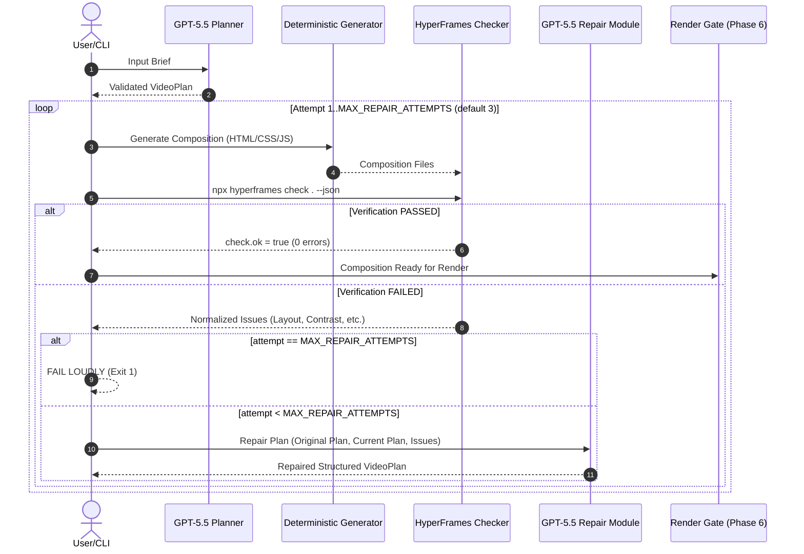

# Phase 5 — Automatic Self-Verification and Repair Loop

## 1. Overview & Purpose

Phase 5 implements the assignment's hard quality control requirement: an **automated self-verification and repair loop**.



Rather than assuming LLM-generated compositions are correct, the system runs `npx hyperframes check <comp-dir> --json` against every generated composition. If quality errors are detected, the system extracts issue findings and invokes GPT-5.5 to repair the **structured plan**, then regenerates the composition deterministically until all checks pass or `MAX_REPAIR_ATTEMPTS` is reached.

---

## 2. Why Self-Verification is Required

Motion graphics generated by AI models often suffer from subtle visual defects that are hard to detect without rendering:
- Text overflowing container bounds on different aspect ratios.
- Contrast ratio violations (WCAG AA failure, e.g. white text on light purple background).
- Uncaught JavaScript errors during timeline execution.
- Missing timeline elements or broken motion assertions.

Treating **HyperFrames as the authoritative gatekeeper** ensures that no invalid or visually broken video is ever rendered into a final MP4 product.

---

## 3. Key Architectural Decision: Plan-Level Repair vs. Code Rewriting

We explicitly reject asking GPT-5.5 to arbitrarily rewrite HTML/JS code directly.

### Why Plan-Level Repair is Superior:
1. **Constrained Search Space**: Modifying a structured JSON `VideoPlan` keeps model edits strictly bounded within Zod schema rules (`VideoPlanSchema`) and semantic checks (`validatePlanSemantics`).
2. **Determinism**: The application's deterministic composition generator (`src/composition/generator.ts`) remains responsible for compiling HTML/CSS/JS.
3. **Preventing Code Corruption**: Arbitrary LLM code editing risks introducing syntax errors, breaking scripts, or generating arbitrary un-testable HTML structures.
4. **Drift Control**: Modifying structured JSON allows the application to compare fields before and after repair, preventing the model from discarding required content or changing aspect ratios.

---

## 4. Repair Prompt Design & Issue Awareness

The repair prompt (`src/repair/prompt.ts`) provides structured, category-specific advice based on normalized HyperFrames findings:

- **LAYOUT**: Advises shortening headings (max 80 chars) or subtitles (max 160 chars), adjusting scene layout presets (`centered`, `split_left`, `split_right`, `stacked_top`, `grid_3col`, `hero_card`), and limiting callout lists.
- **CONTRAST**: Advises updating theme color tokens (`textColor`, `backgroundColor`, `primaryColor`, `accentColor`, `surfaceColor`, `gradientEnd`) to ensure WCAG AA compliance (3:1 / 4.5:1 ratio), using suggested hex colors from contrast findings.
- **MOTION**: Advises simplifying animation presets (`entrance`, `exit`, `ambient`), ensuring keyframe timings remain inside scene boundaries.
- **RUNTIME**: Advises sanitizing scene identifiers and fixing timeline parameters.
- **LINT**: Advises correcting schema values.
- **UNKNOWN**: Passes raw finding context directly to the model without discarding details.

### Strict Repair Rules Enforced on Model:
1. Preserve original creative intent and title.
2. Make smallest change necessary to fix reported issues.
3. Do not arbitrarily redesign the entire video.
4. Do not change aspect ratio unless required.
5. Do not change total duration unless timing requires it.
6. Do not remove core user content to hide errors.
7. Output strictly parsable JSON matching `VideoPlanSchema`.

---

## 5. Drift Prevention & Ineffective Repair Guards

To prevent iterative model drift (e.g. turning a "developer analytics ad" into a "generic product pitch" over 3 attempts):
- **Drift Detection (`detectPlanDrift`)**: Rejects repaired plans that alter aspect ratio, drastically cut duration, or drop more than 50% of scenes.
- **Identical Plan Detection (`isIdenticalPlan`)**: Detects if the model returns the exact same plan without applying changes. If identical plan is returned while errors persist, the repair is rejected to prevent infinite loops.

---

## 6. Bounded Attempts & Failure Semantics

The repair process is governed by a central configuration limit:
```typescript
export const DEFAULT_MAX_REPAIR_ATTEMPTS = 3;
```

Separate limits exist for each pipeline stage to prevent uncontrolled retry explosions:
- `MAX_PLAN_ATTEMPTS = 3` (Planner recovery)
- `MAX_IMAGE_ATTEMPTS = 3` (Asset generation retry)
- `MAX_REPAIR_ATTEMPTS = 3` (HyperFrames verification repair loop)

### Failure Semantics:
If `MAX_REPAIR_ATTEMPTS` is reached without a passing check:
1. The pipeline **terminates immediately with exit code 1**.
2. All remaining unresolved errors are printed to stdout/stderr.
3. Attempt artifacts are preserved at `outputs/<run-id>/attempts/`.
4. **NO final MP4 is rendered or reported as successful**.

---

## 7. Artifact Structure & Machine-Readable History

For every execution, per-attempt artifacts are saved:

```
outputs/<run-id>/
├── brief.txt
├── repair-history.json
├── plan.json                 (Final passing plan)
├── composition/              (Final passing HyperFrames composition)
└── attempts/
    ├── attempt-1/
    │   ├── plan.json
    │   ├── check.json
    │   └── composition/
    ├── attempt-2/
    │   ├── plan.json
    │   ├── check.json
    │   └── composition/
    └── attempt-3/
```

### Machine-Readable History (`repair-history.json`):
```json
[
  {
    "attempt": 1,
    "status": "failed",
    "timestamp": "2026-09-02T19:00:00.000Z",
    "durationMs": 120,
    "issues": [
      {
        "id": "contrast:contrast_aa_failure:0",
        "category": "contrast",
        "severity": "error",
        "code": "contrast_aa_failure",
        "message": "Contrast ratio 1.8:1 is below 3:1 WCAG AA minimum"
      }
    ],
    "repaired": true
  },
  {
    "attempt": 2,
    "status": "passed",
    "timestamp": "2026-09-02T19:00:05.000Z",
    "durationMs": 95,
    "issues": [],
    "repaired": false
  }
]
```

All credentials (OpenAI/Gemini keys, bearer tokens) are sanitized prior to writing artifacts or logs (`sanitizeOutput`).
